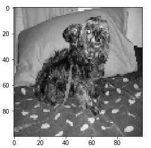

# CatsandDogs_Classifier
## OverView
I am taking raw images of Cats and Dogs and then feeding them through a convolutional neural network for classification. 
The images are either of dogs or cats.

## Data Resource
Dataset consists 12500 RGB images of cats and 12500 RGB images of dogs. 
You can download data from here. 
https://www.microsoft.com/en-us/download/confirmation.aspx?id=54765

## Dependencies
Jupyter Notebook

### Packeges
tensorflow 
numpy 
matplotlib 
opencv 
pickle 
random 
os

### Data Preprocessing
 We've got the data, but we can't exactly just stuff raw images right through our convolutional neural network.   
 we need all of the images to be the same size, and then we also will probably want to just grayscale them. 
 Also, the labels of "cat" and "dog" are not useful, we want them to be one-hot arrays.

### Normalized image size
 100*100
 
 ### Sample Grayscale Image Before Resizing  
 
                             
 
 ### Sample Grayscale Image After Resizing
 
  
 
 ## Model
 ### Convolutional Neural Network
 Training Set= 12451 Samples 
 Validation Set= 2495 Samples
 
 ### Activation Functions
 1. Relu
 2. Sigmoid
 
 ### Optimizer 
 Adam 
 Batch Size=32 
 Epochs=10
 
 ## Accuracy= 94.03%
 ## Validation Accuracy= 84.3%
 
 
 
 
 
